# Atomic Red Team: T1053.005 Scheduled Task (full troubleshooting log)

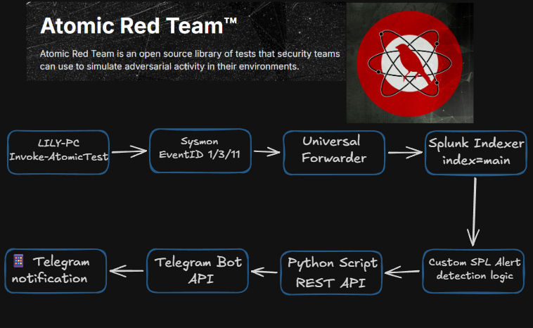
## Goal

Install Atomic Red Team on a lab workstation, run a first atomic test (T1053.005, Scheduled Task), check what the SIEM actually sees, write a detection for it, and get the alert to my phone through the existing Telegram watcher.

## Environment

| Component | Details |
|---|---|
| Test host | LILY-PC (`BRAYAN-LAB\lily.smith`, local admin), Windows 10 build 19041, Proxmox VM 108 |
| Framework | Invoke-AtomicRedTeam 2.1.0 + atomics folder, installed in `C:\Users\lily.smith\Desktop\Red Atomic Team\` |
| Telemetry | Sysmon (SwiftOnSecurity config) + Windows Security and System logs, Splunk UF → indexer `index=main` |
| Alerting | Splunk scheduled alert → `telegram_alert_watcher.py` (cron on the Splunk VM) → Telegram bot |

Times in Splunk screenshots are UTC. LILY-PC and my own PC run on UK time (BST, UTC+1).

## Setup

I chose LILY-PC (local admin) over MARKUS-PC (standard user) to avoid permission friction during the first tests.

Before downloading anything, I created a folder on the Desktop called `Red Atomic Team` and excluded it from Windows Defender. The atomics contain offensive test content, and Defender would quarantine part of it.

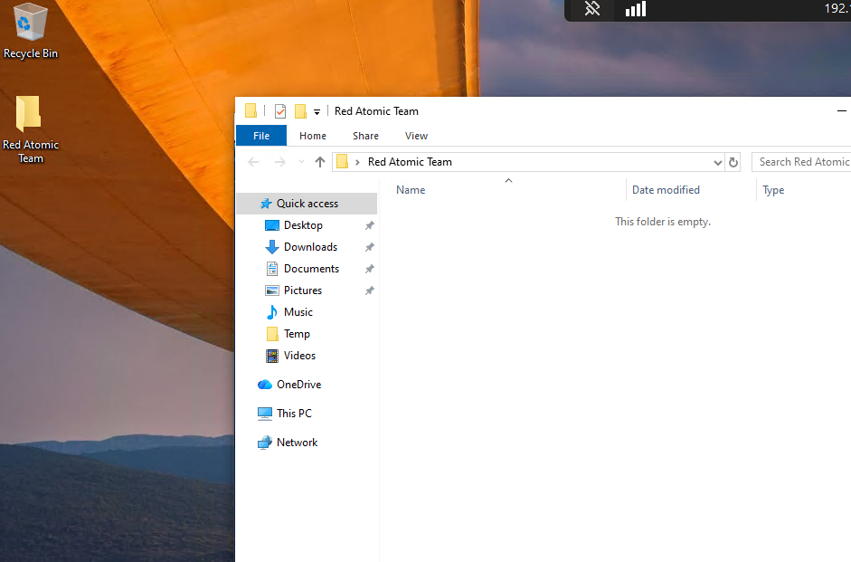

**Two repositories:**
- `atomic-red-team` holds the YAML technique definitions (the "what").
- `invoke-atomicredteam` is the PowerShell execution engine (the "how").

I first tried to download the zip manually, but Edge blocked it:

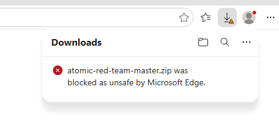

I wouldn't call this a false positive. The repository contains real offensive test content, so SmartScreen is reacting to something that does exist. It's expected behaviour for this tool, which is why the Defender exclusion was needed in the first place.

Instead I used the official installer. It installs the module and, with `-getAtomics`, downloads the atomics folder in the same run:

```powershell
IEX (IWR 'https://raw.githubusercontent.com/redcanaryco/invoke-atomicredteam/master/install-atomicredteam.ps1' -UseBasicParsing)
Install-AtomicRedTeam -InstallPath "C:\Users\lily.smith\Desktop\Red Atomic Team" -getAtomics -Force
```

The first line downloads the installer script and loads its function into memory. The second one does the actual install. It also pulls the `powershell-yaml` dependency from the PowerShell Gallery, which is why it asked to install the NuGet provider first.

Also, `IEX (IWR ...)` is a download cradle, the same pattern attackers use (T1059.001). It's fine here because I know the source, but it's a pattern worth detecting later.

### Execution Policy

The first install failed:

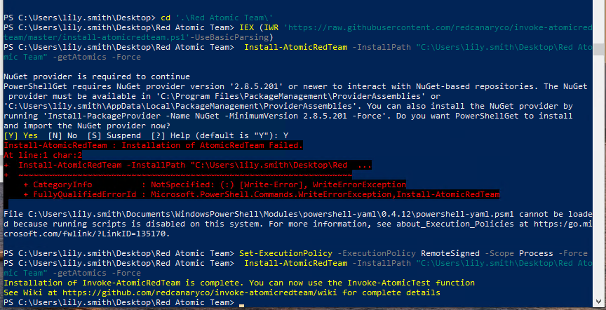

The `powershell-yaml` module couldn't load because "running scripts is disabled on this system". On Windows 10 clients the Execution Policy defaults to `Restricted`, which blocks every script. It is a PowerShell setting, not an antivirus feature. I fixed it for that session only:

```powershell
Set-ExecutionPolicy -ExecutionPolicy RemoteSigned -Scope Process -Force
```

`-Scope Process` only affects the current PowerShell session. After that, the install completed and the atomics folder was populated:

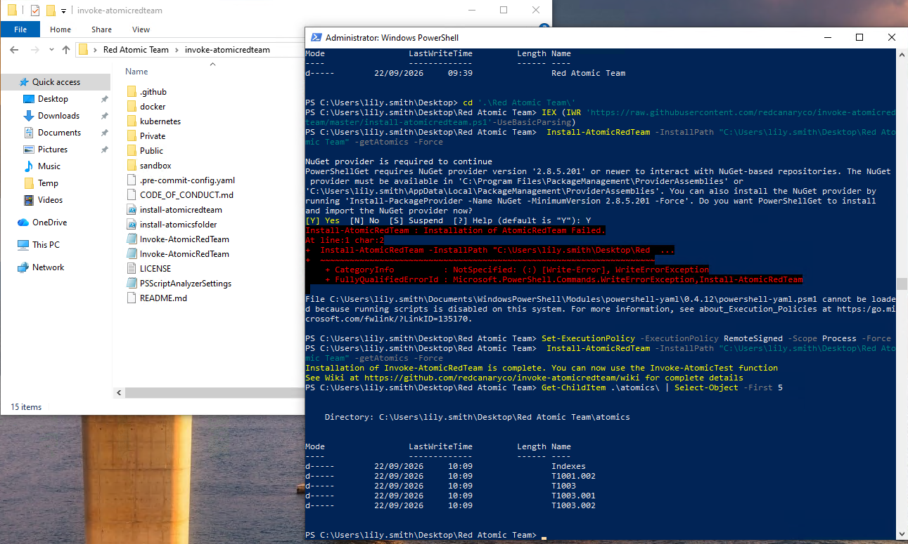

The module loads and `Invoke-AtomicTest` 2.1.0 is available:

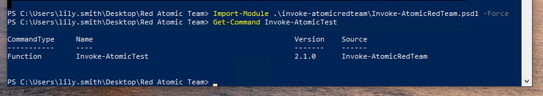

I closed this phase with a Proxmox snapshot, `Atomic_Red_Team_Clean`: framework installed, zero tests run.

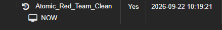

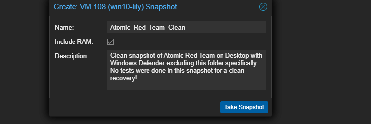

## Running T1053.005

### Session routine

`Invoke-AtomicRedTeam` is a module that isn't in a default module path, so every new PowerShell window starts without it:

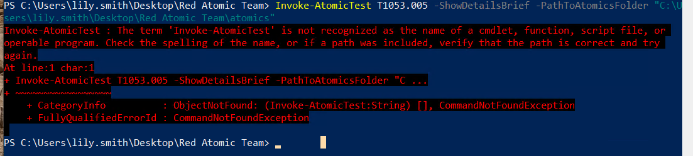

Every session needs the same routine:

```powershell
Import-Module "C:\Users\lily.smith\Desktop\Red Atomic Team\invoke-atomicredteam\Invoke-AtomicRedTeam.psd1" -Force
Invoke-AtomicTest T1053.005 -ShowDetailsBrief -PathToAtomicsFolder "C:\Users\lily.smith\Desktop\Red Atomic Team\atomics\"
```

**Why `-PathToAtomicsFolder` has to be passed explicitly.** In my original notes I wrote that the `$PathToAtomicsFolder` session variable "didn't reliably get picked up". The screenshots show it more precisely. I set the variable in the console, and `Invoke-AtomicTest` still looked for the atomics in `C:\AtomicRedTeam\atomics`:

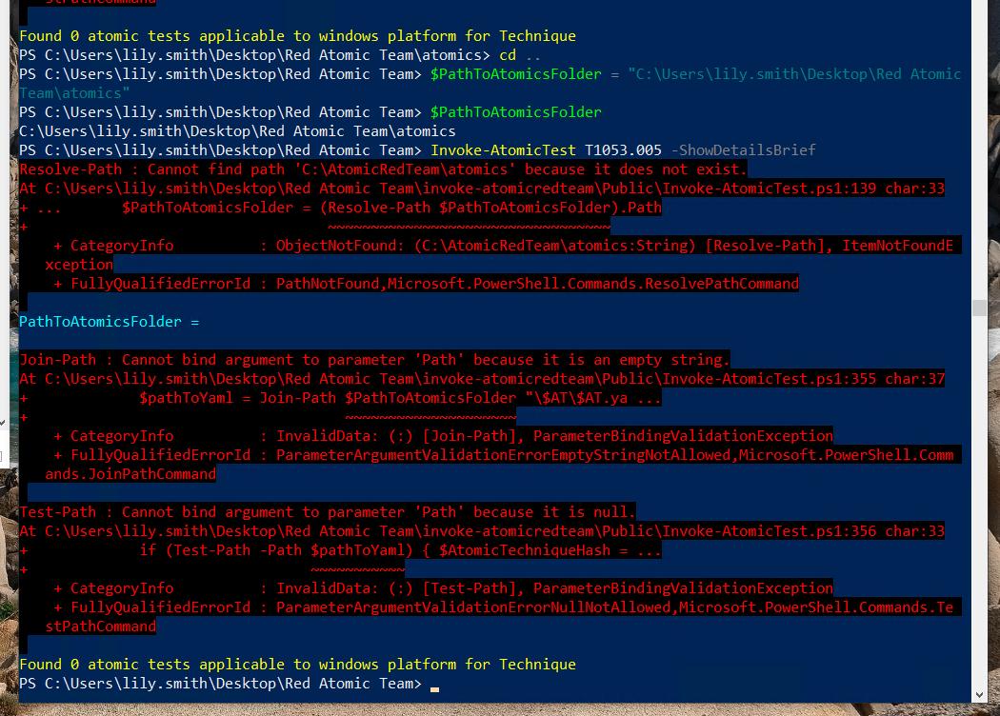

`C:\Red Atomic Team\atomics` is the module's default install location. The function has its own default value for that parameter and doesn't read a variable I set in the console. Because I installed to a non-default path, the default fails every time. There are two options:
- pass `-PathToAtomicsFolder` on every call, which is what I did, or
- set `$PSDefaultParameterValues = @{"Invoke-AtomicTest:PathToAtomicsFolder" = "<path>"}` once per session.

### The Execution Policy again

In a later session the import failed with the same "running scripts is disabled" error, because the `-Scope Process` fix from the install only lived in that earlier window. This time I used `-Scope CurrentUser`:

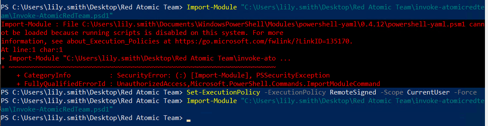

**Correction to my original note:** I wrote that the fix was "scoped to Process on purpose, no permanent system change". That was true for the install, but the `CurrentUser` change is persistent for `lily.smith`. It isn't machine-wide, but it is permanent until I revert it with `Set-ExecutionPolicy Undefined -Scope CurrentUser`.

### Choosing and running the test

`-ShowDetailsBrief` lists every sub-test for the technique without running anything:

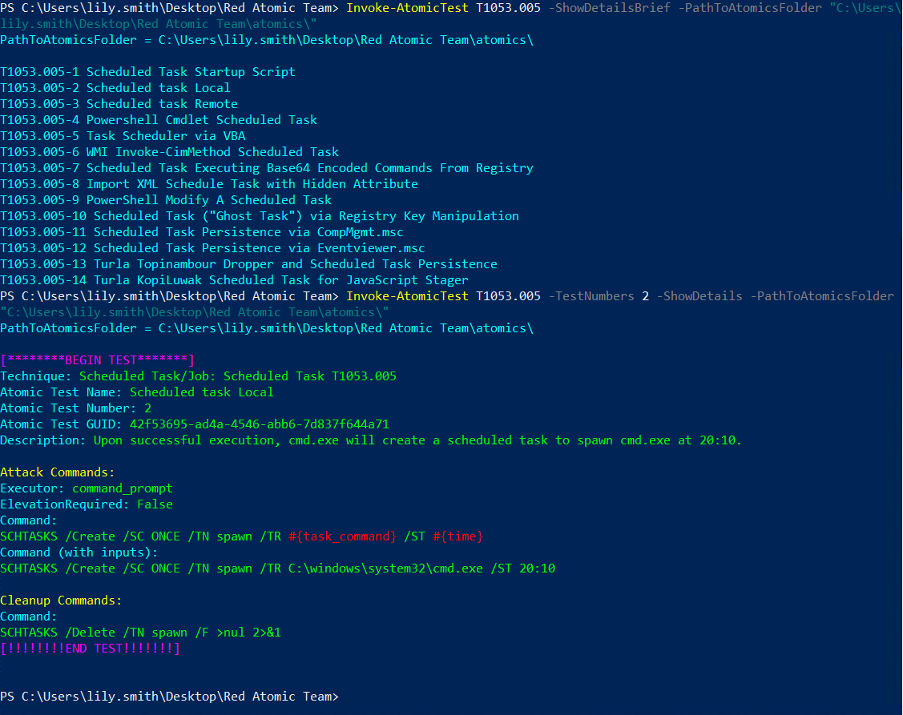

T1053.005 has 14 sub-tests, covering everything from startup-folder shortcuts to WMI-based scheduling to fileless "ghost task" registry tricks. I picked **test 2, "Scheduled task Local"**: on success, `cmd.exe` creates a scheduled task named `spawn` that runs `cmd.exe` at 20:10, via `SCHTASKS /Create /SC ONCE /TN spawn /TR C:\windows\system32\cmd.exe /ST 20:10`.

Ran it:

```powershell
Invoke-AtomicTest T1053.005 -TestNumbers 2 -PathToAtomicsFolder "C:\Users\lily.smith\Desktop\Red Atomic Team\atomics\"
```

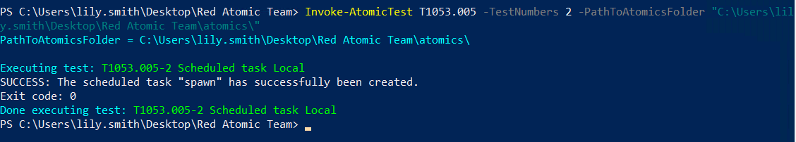

`SUCCESS: The scheduled task "spawn" has successfully been created.` Exit code 0.

### Confirming it in Sysmon

```
index=* host="lily-pc" EventCode=1 *schtasks*
```

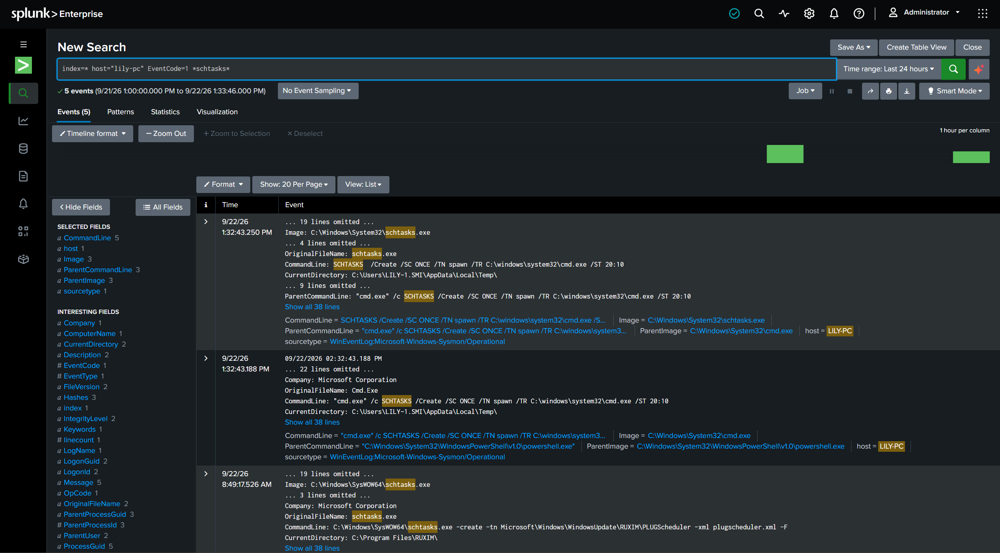

The full event:

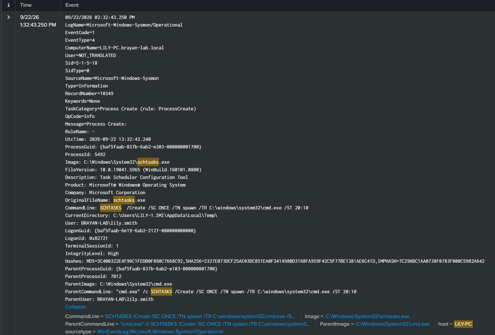

`Image: C:\Windows\System32\schtasks.exe`, `ParentImage: C:\Windows\System32\cmd.exe`, `CommandLine: SCHTASKS /Create /SC ONCE /TN spawn /TR C:\windows\system32\cmd.exe /ST 20:10`, `User: BRAYAN-LAB\lily.smith`, `IntegrityLevel: High`. Matches the atomic exactly.

The same search over the last 24 hours also caught something I wasn't testing: a real `schtasks.exe -create -tn Microsoft\Windows\WindowsUpdate\RUXIM\PLUGScheduler ...` call, unrelated to me, created under the `Microsoft\Windows` task namespace. I come back to this below, it turned out to be useful evidence, not noise to ignore.

### Getting EventCode 4698

At this point I only had Sysmon forwarding from LILY-PC, no Security, no System. For T1053.005 the real "textbook" event is EventCode 4698 (a scheduled task was created) in the Security log, and it's a lot richer than Sysmon alone: full XML of the task, the account that created it, the trigger boundary. Problem: that event needs the "Audit Other Object Access Events" advanced audit subcategory enabled, which is NOT on by default in Windows, and Security/System weren't even in the UF's `inputs.conf` yet.

Fixed both things:
- Added `[WinEventLog://Security]` and `[WinEventLog://System]` stanzas to `inputs.conf`, pushed through the Splunk Configs share.
- New GPO linked to Workstations: Advanced Audit Policy Configuration → Object Access → Audit Other Object Access Events → Success.

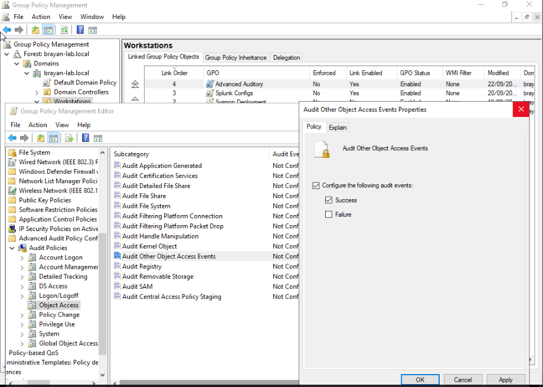

Same Link Order lesson as the Splunk AD Lab Deployment project applies here too: this new GPO ("Advanced Auditory") sits at Link Order 4, after Splunk Configs (3) and Sysmon Deployment (2). Link order is the processing sequence, and the lower numbers run first, from 1 upwards, so this link is applied after the ones below it in the list.

Verified locally before trusting it:

```
auditpol /get /subcategory:"Other Object Access Events"
```

Rebooted LILY-PC and MARKUS-PC to pick up both changes. GPO startup scripts only run at boot, `gpupdate /force` doesn't re-trigger them, but the audit policy itself does apply live through `gpupdate /force`. The `inputs.conf` copy still needed the actual restart.

With that in place:

```
index=* host="lily-pc" EventCode=4698
```

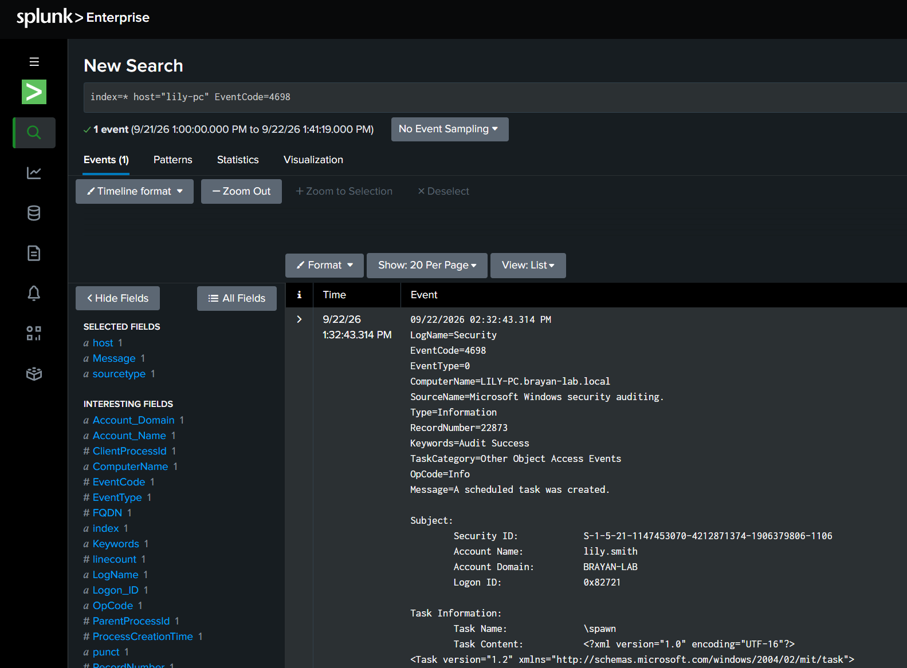

`TaskCategory=Other Object Access Events`, `Message=A scheduled task was created.`, `Account Name: lily.smith`, `Task Name: \spawn`, followed by the full task XML. Correlating this with the Sysmon event above gives the complete picture of what a real T1053.005 persistence attempt looks like from both angles.

### Detection: V1 vs V2

I compared two exclusion strategies for the detection:
- **V1** excludes by `ParentImage` (e.g. `msiexec.exe`, a common legitimate installer parent for scheduled tasks).
- **V2** excludes by `CommandLine` not containing `Microsoft\Windows`, the task namespace legitimate Windows/vendor tasks use.

Went with V2. It's structurally more robust: if `msiexec.exe` itself got compromised and used to create a malicious task, V1 would blindly exclude it just because of who the parent process is, while V2 still flags it unless the attacker *also* fakes the `Microsoft\Windows` naming convention, a real evasion technique, but a much higher bar than simply abusing a trusted parent. Same "trusted process problem" as the `claude.exe` exclusion from the PowerShell detection project: every exclusion buys a blind spot, the question is which one is smaller.

The `Microsoft\Windows\WindowsUpdate\RUXIM\...` task I found by accident while confirming the Sysmon event turned out to be a good real-world test of that choice: it's exactly the kind of legitimate vendor task V2 is designed to leave alone, and it does.

Final filter:

```
index=main host="LILY-PC" EventCode=1 Image="*\\schtasks.exe" CommandLine="*/Create*" NOT CommandLine="*Microsoft\\Windows*"
```

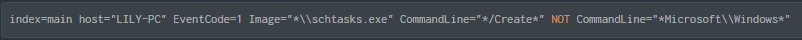

One result: the `spawn` test, nothing else.

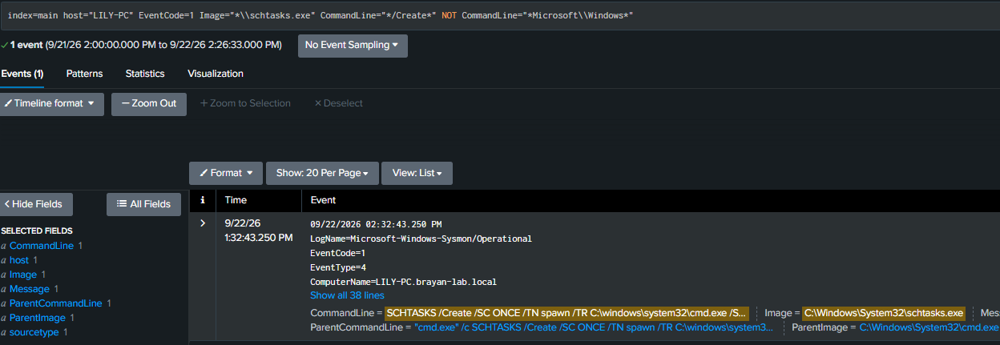

### Alert and delivery

Saved it as an alert, `*/5 * * * *`, trigger condition "Number of Results is greater than 0", 14-day expiry, action "Add to Triggered Alerts":

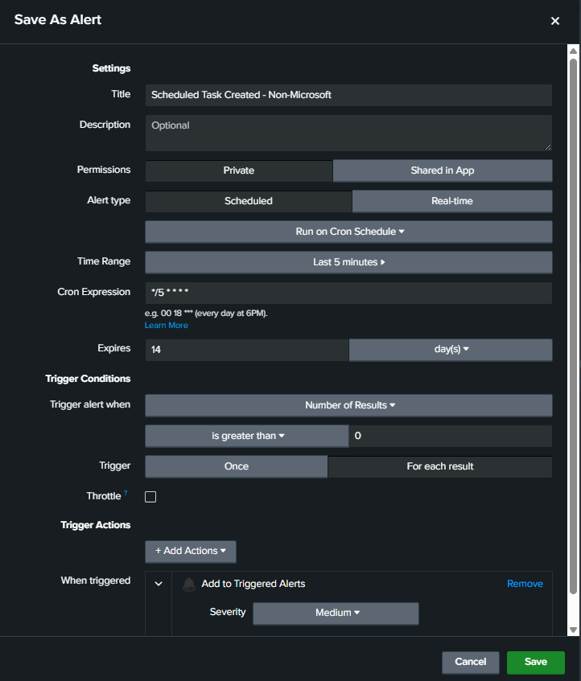

Because the alert-delivery pipeline already existed from the previous project (a cron job on the Splunk VM polling `fired_alerts` every 2 minutes and pushing to Telegram), I expected this to just work.

It didn't, the first time. `telegram_alert_watcher.py` was hardcoded to poll `/services/alerts/fired_alerts/{ALERT_NAME}` for one specific alert name, the old PowerShell detection, so the new alert was never even queried. Generalized it to hit `/services/alerts/fired_alerts` for all alerts, but that endpoint only returns a list of alert *names* that have fired, not the actual instances with `trigger_time`/`sid`, so I added a second step querying each name individually to get the real fired instances. Also had to move state tracking from one global "last seen" timestamp to a per-alert-name dict, since different alerts fire on different schedules.

Along the way also hit a Telegram `400 Bad Request: message is too long` on an unrelated alert (the MSI alert's `CommandLine` summary exceeded Telegram's character limit), so wrapped `send_telegram()` in a try so one bad message doesn't kill the whole run.

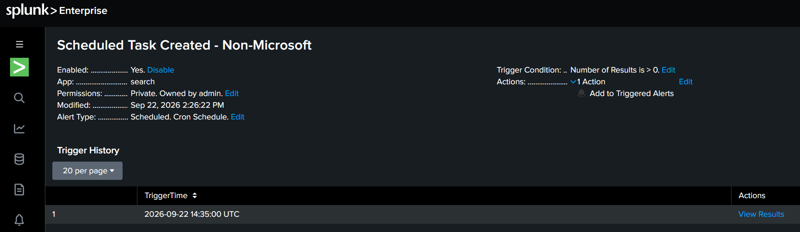

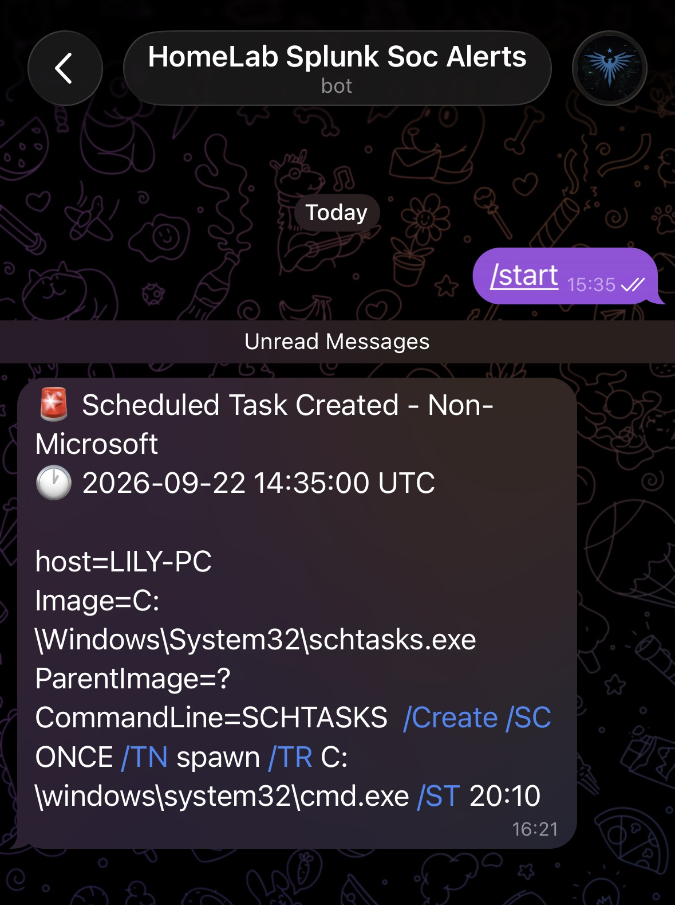

Trigger history on the alert confirms it fired at `2026-09-22 14:35:00 UTC`, matching the timestamp in the Telegram message exactly. The message itself arrived a bit later than that, since I was still mid-troubleshooting on the script at the time.

Also a mention for the later writeups, the folder was originally Red Atomic Team; it was renamed to RedAtomicTeam(without spaces) later, because paths with spaces caused friction when running the techniques from cmd.exe

## Result

End to end: Atomic Red Team runs T1053.005 on LILY-PC, Sysmon and Security log both capture it, the SPL filter (V2) picks it up while ignoring legitimate `Microsoft\Windows` tasks, the Splunk alert fires, and the generalized watcher script pushes it to Telegram, with no manual step in the middle. 

