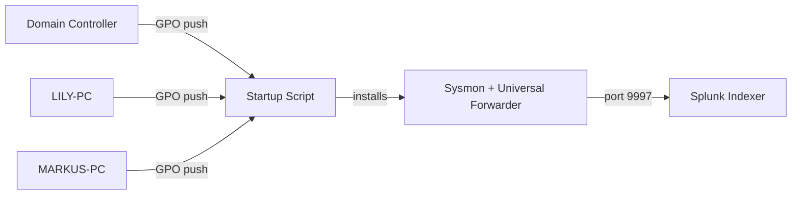

# Splunk AD Lab Deployment

**Full troubleshooting log (every dead end, with screenshots):** [splunk-ad-lab-deployment_full.md](./splunk-ad-lab-deployment_full.md)

**Goal:** Get visibility across every machine in the domain without touching them one by one. This is a small AD lab (1 domain controller, 2 workstations), but the deployment problem scales the same way it would on a real network: push agents through Group Policy instead of installing manually on each host.

GPO Startup Scripts install Sysmon and the Splunk Universal Forwarder on boot, running as SYSTEM, no manual login needed. Once installed, the Forwarder reads Sysmon events and ships them to the indexer over port 9997.

**The problem worth explaining**

After deployment, the Forwarder service was running and the network connection to the indexer was fine (port 9997 reachable), but no Sysmon events showed up in Splunk. No error on the surface, the service just stayed quiet.

The Universal Forwarder runs under a virtual service account (`NT SERVICE\SplunkForwarder`), not Local System. Windows locks the Sysmon Operational log channel behind its own access list, separate from general service privileges — running the service isn't enough to read a protected log channel. The Forwarder was trying to subscribe to the channel and getting rejected silently.

Found it by reading `splunkd.log` directly (not the Event Viewer, which showed nothing useful) and searching for the subscription error. Fix: add the virtual account to the built-in `Event Log Readers` group, which grants read access to Windows logs without full admin rights. I had this exact pattern before with a Wazuh agent months earlier, same root cause, different tool: a low-privilege service account needing explicit group membership to read a protected log source.

**Result:** all 3 domain machines confirmed sending Sysmon logs to `index=main`.

**What I took from this:** deploying an agent isn't the same as confirming it's actually producing data. "Service running + network reachable" isn't proof of a working pipeline, you have to verify the data is landing where you expect it.
