# Splunk AD Lab Deployment (full troubleshooting log)

**Goal:** Deploy Splunk Universal Forwarder (UF) and Sysmon on every machine of my Active Directory lab using only Group Policy, and have all the Sysmon events in my Splunk indexer.

**Short version of this project:** [splunk-ad-lab-deployment.md](./splunk-ad-lab-deployment.md)

This is the long one. Every dead end, every wrong turn and every fix, with screenshots. If you just want the summary, go to the short write-up!

## Environment

| Component | Details |
|---|---|
| Hypervisor | Proxmox (mini PC, 32 GB RAM) |
| Lab network | `vmbr1`, isolated, no internet |
| Domain Controller | `WIN-AAMP3TUDTBL`, Windows Server 2019 |
| Workstations | `win-lilly`, `win-marcus`, Windows 10 |
| Indexer | Splunk on a separate Ubuntu Server VM |
| Splunk license | Trial expired, running on the Free license |
| Sysmon config | SwiftOnSecurity `sysmonconfig-export.xml` |

## Issues index

1. The UF install through GPO Software Installation fails
2. Deployment Server is not available on the Free license
3. The order of startup scripts across GPOs
4. The disks were too small and the WinRE partition blocked Extend Volume
5. The UF runs but can't read the Sysmon channel

# Build steps

This is the normal setup. Not where the fun problems were, but it's the path I took so here it is.

### Temporary internet access for the DC

My AD lab lives on `vmbr1`, which has no internet on purpose. The thing is I needed internet on the Domain Controller just to download the UF `.msi` (and later Sysmon). The SMB share itself is fine inside `vmbr1`, that part doesn't need internet at all.

I didn't want to touch the NIC I already had, because its IP is the DNS server for the whole domain and if I change it my AD breaks. So I just added a second network device on `vmbr0` to the DC.

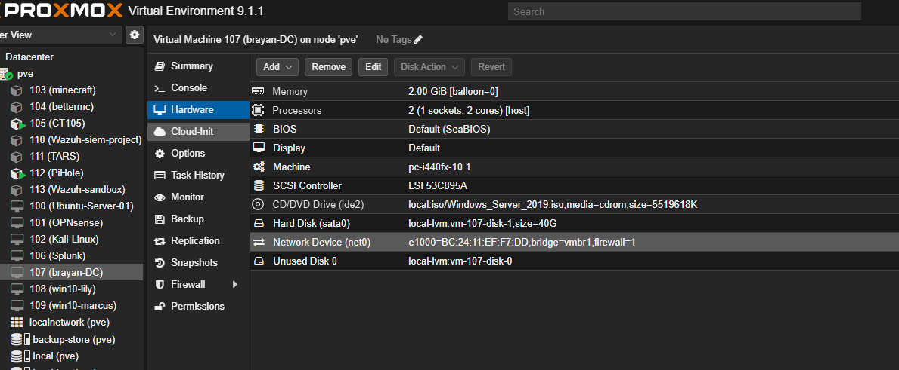


I kept this second NIC after the downloads, I didn't remove it. I use it whenever I need to pull a new file onto the DC, and also to RDP into it from outside the isolated `vmbr1` network.

### RDP to the DC

Downloading stuff with Internet Explorer on Server 2019 was a pain, so I enabled Remote Desktop on the DC (it was Disabled) and did everything over RDP instead.

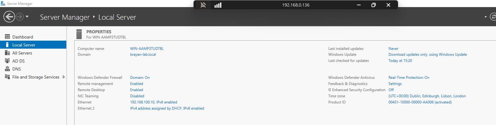

Then another small problem: copy worked from the RDP session, but paste didn't! The fix is to end the `rdpclip.exe` task in Task Manager on the server and run it again from Run (`rdpclip.exe`). After that it was working.

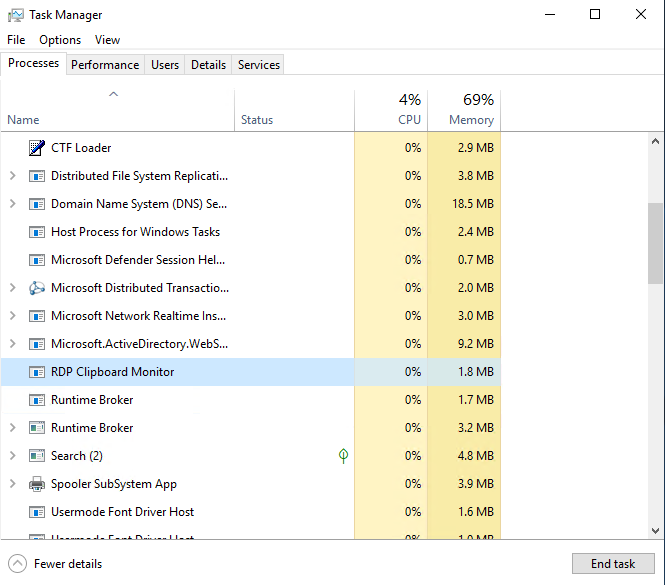

### SMB share for the installers

I made a folder on the DC for the installers and shared it over SMB.

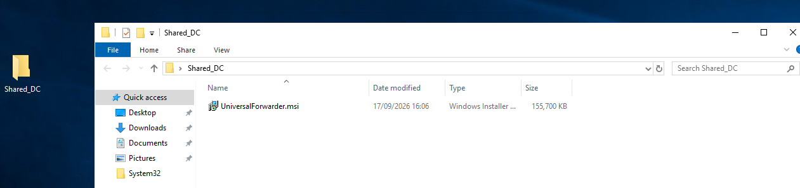
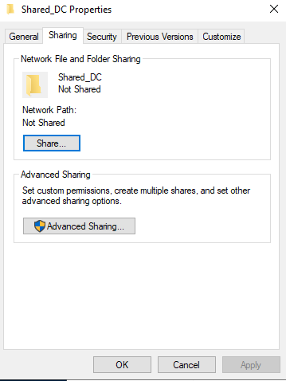
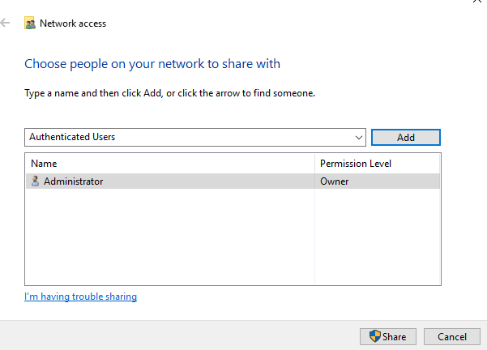
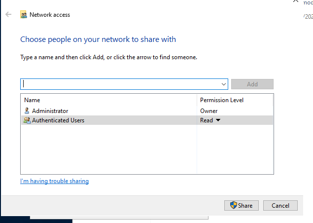
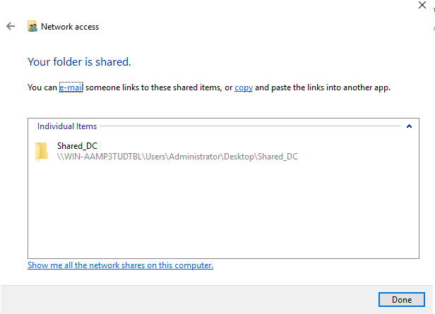

This is the path I used later in every GPO:

```
\\WIN-AAMP3TUDTBL\Users\Administrator\Desktop\Shared_DC\
```

Something I noticed later: this share root sits under `C:\Users`, so technically it exposes every profile on the DC, not only my shared folder. In production I'd use a dedicated share, or `NETLOGON`/`SYSVOL`, with read access only for Domain Computers instead of Everyone. I caught this quite late so I didn't rebuild it, but I understand this would be a security risk!

### Organizational Unit for the workstations

A GPO can only be linked to a site, the domain or an OU. My `win-lilly` and `win-marcus` were sitting in the default `Computers` container, which is not an OU, so I couldn't link any GPO to them. So I created an OU for the workstations:

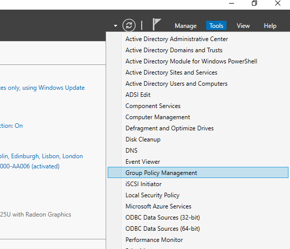
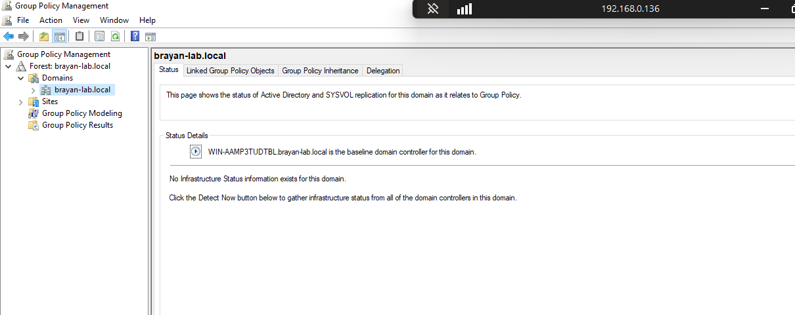
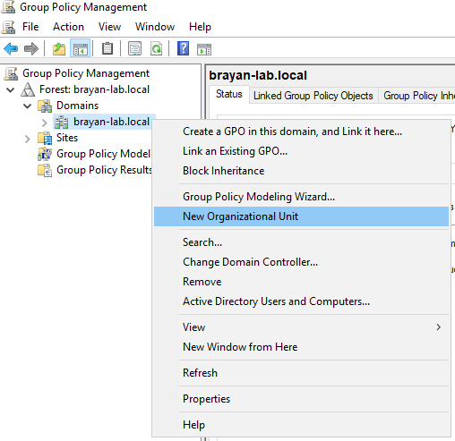

Then in Active Directory Users and Computers I moved both workstations into the new OU:

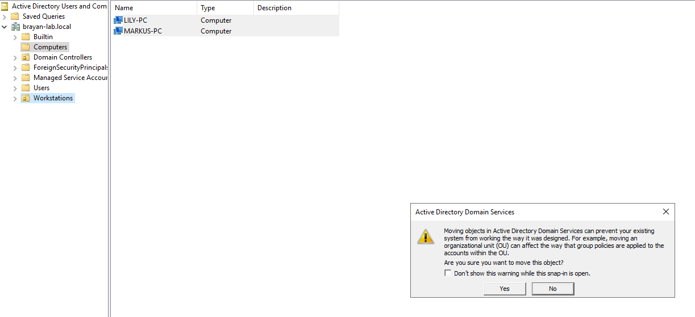
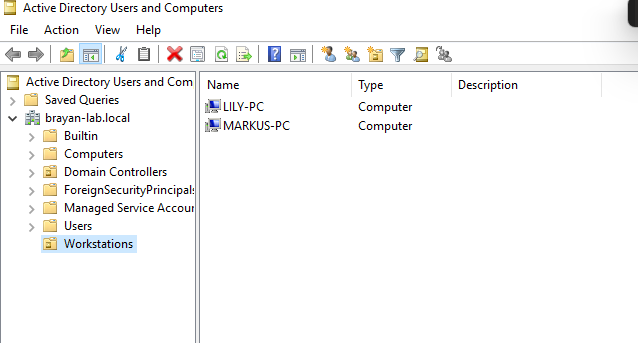

### Creating the deployment GPO

Back in Group Policy Management I created a new GPO and linked it to the OU:

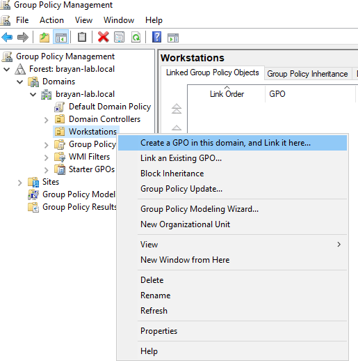
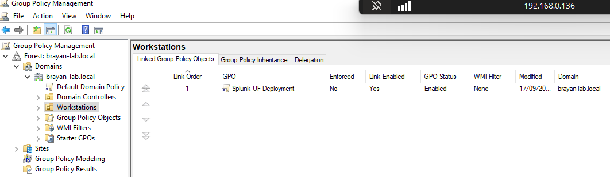

Then Edit → Computer Configuration → Policies → Software Settings → Software Installation → right click → New → Package:

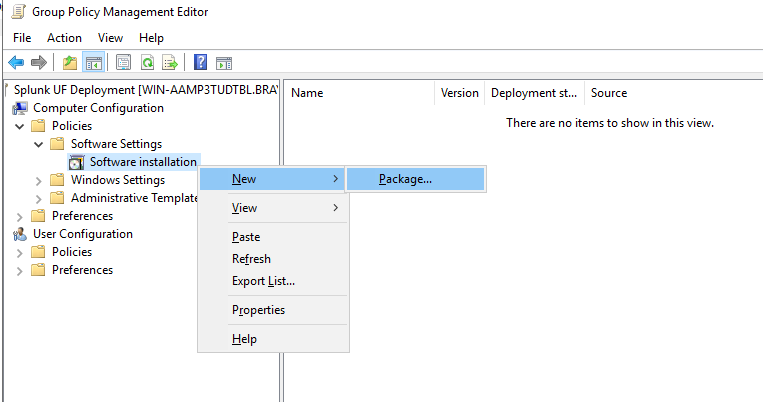

`VERY IMPORTANT` here: the package path has to be the full network path, not a local one, because every client needs to be able to reach it:

```
\\WIN-AAMP3TUDTBL\Users\Administrator\Desktop\Shared_DC\UniversalForwarder.msi
```

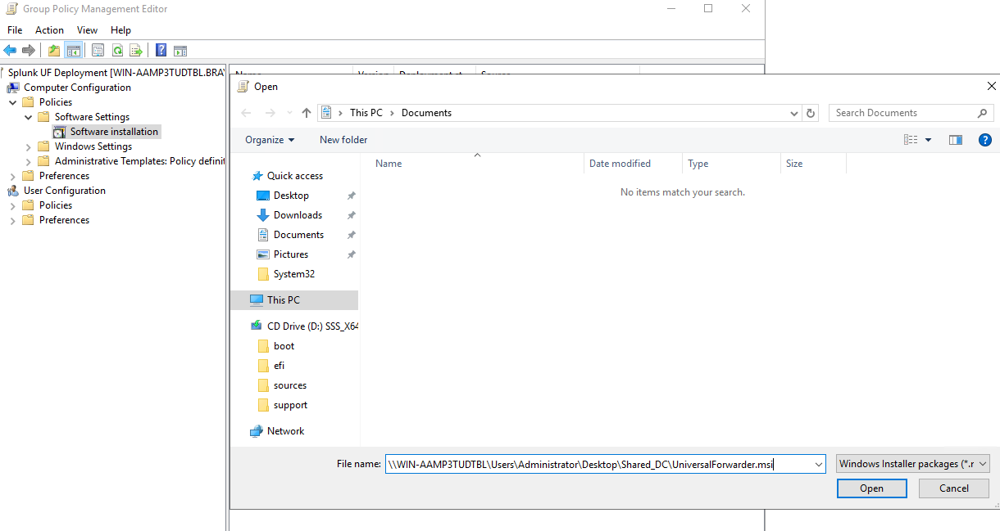
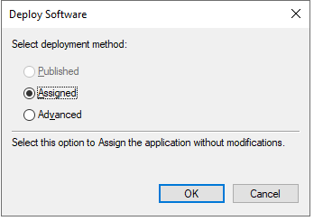

I chose **Assigned**. That means it installs the next time the computer starts, without anyone logging in, which is exactly what you want for a monitoring agent.

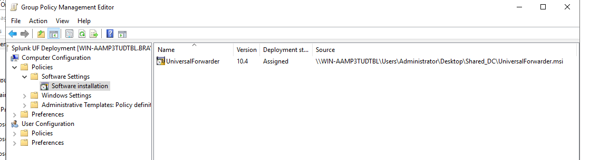

Spoiler: this install failed. I explain everything in Issue 1.

### Sysmon deployment

Once the UF was working, Sysmon was the same method (startup script from the same share), with `sysmon.exe` and the SwiftOnSecurity XML config both in `Shared_DC`.

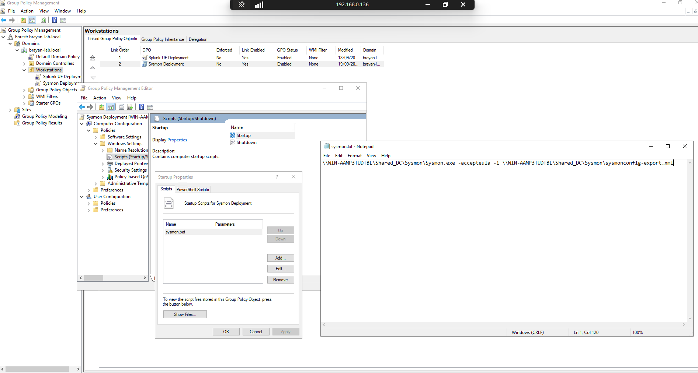

The startup script (`sysmon.bat`) runs:

```bat
\\WIN-AAMP3TUDTBL\Shared_DC\Sysmon\Sysmon.exe -accepteula -i \\WIN-AAMP3TUDTBL\Shared_DC\Sysmon\sysmonconfig-export.xml
```

This time it installed on `win-lilly` and `win-marcus` with no problems at all!

BUT the Domain Controller was still missing, and that's the most important machine. The DC lives in the `Domain Controllers` OU, not in my workstations OU, so it doesn't get the GPOs I linked there. I just linked the same GPOs to the `Domain Controllers` OU too:

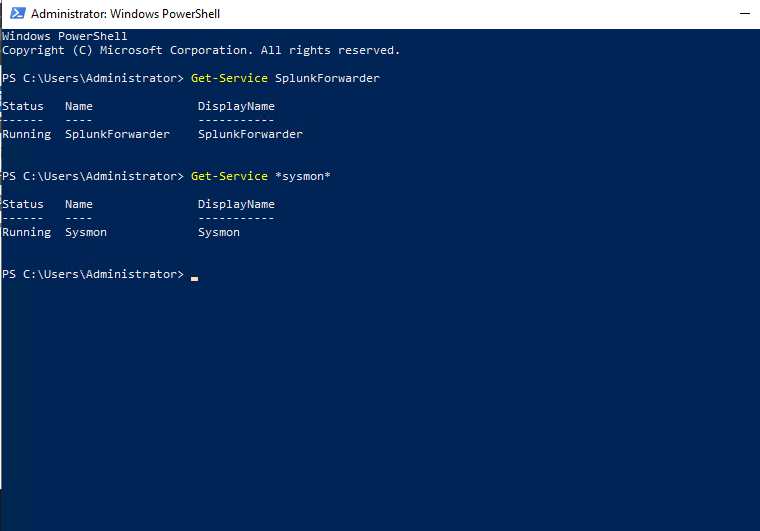

And after that all three machines had the UF and Sysmon installed.

# Issue 1: UF install through GPO Software Installation fails

**Symptom:** I rebooted `win-lilly` and the UF was not there.

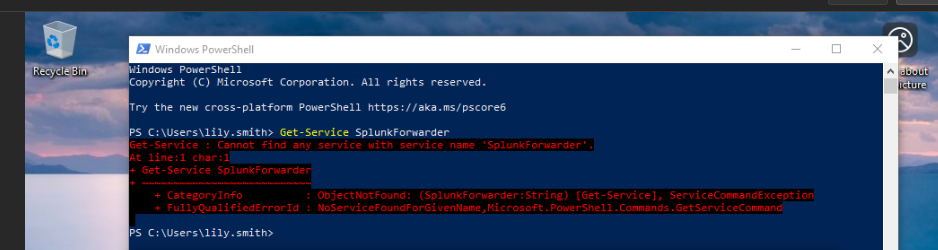

**Evidence:** Event Viewer showed errors saying the software installation couldn't be applied.

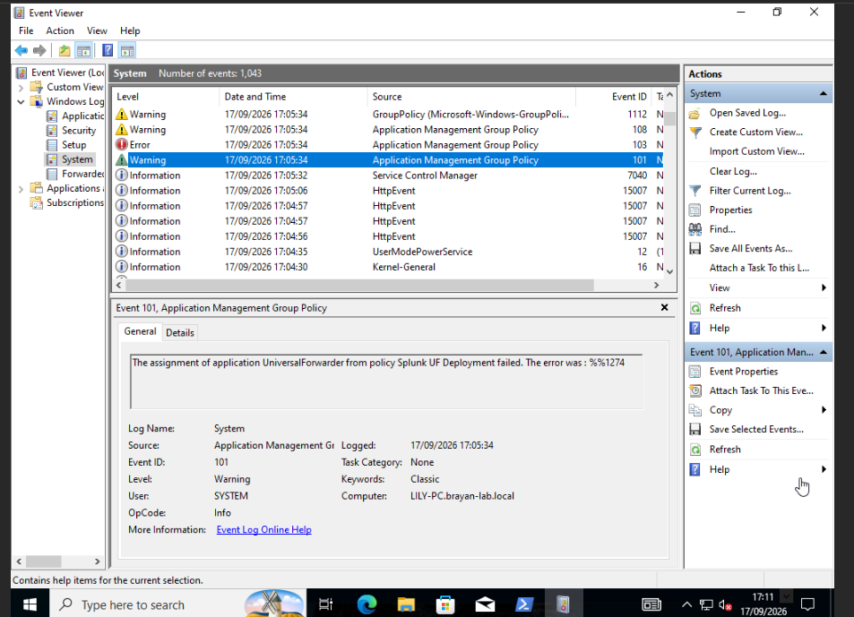

```
Event ID: 101
Source: Application Management Group Policy
Log: System
Computer: LILY-PC.brayan-lab.local

The assignment of application UniversalForwarder from policy Splunk UF Deployment failed. The error was: %%1274
```

**Ruled out, one by one:**

1. **File not reachable?** No. From `win-lilly` I opened the network path by hand and I could reach the `.msi` without problems, so it wasn't about reaching the file.
2. **Timing / GPO processing?** I changed this policy in the Group Policy Management Editor:

   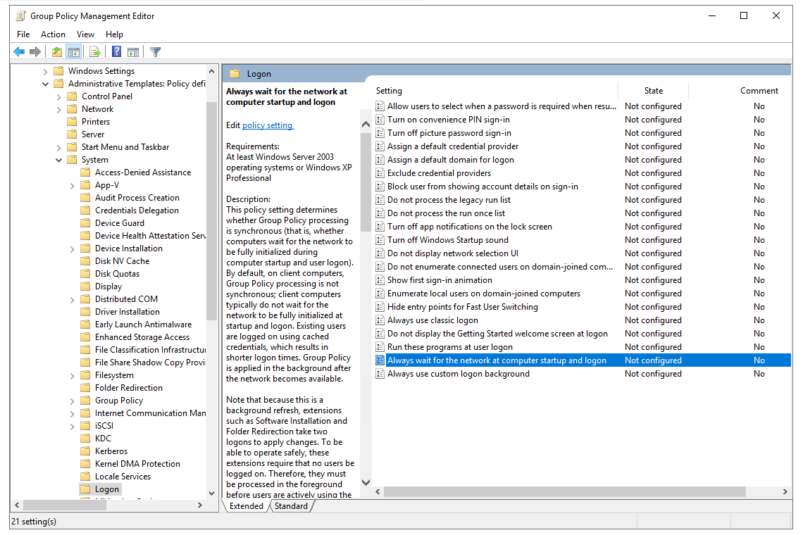
   

   Policy: Computer Configuration → Administrative Templates → System → Logon → **"Always wait for the network at computer startup and logon"**, set to Enabled.

   I rebooted `win-lilly` and `win-marcus` and this time I got something different.

   ```
   Event ID: 301
   Source: Application Management Group Policy
   Log: System

   The assignment of application UniversalForwarder from policy Splunk UF Deployment succeeded.
   ```

   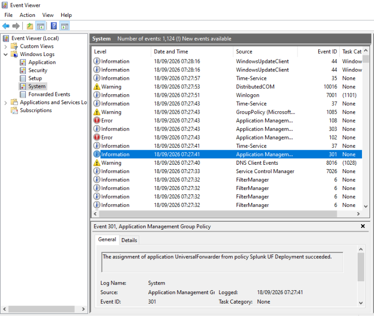

   The install itself still failed after that. This screenshot only caught the assignment succeeding, not the install error, that one I only saw later when I turned on verbose logging (below).

3. **Permissions?** I made sure the folder was really shared and gave Everyone read on the share permissions:

   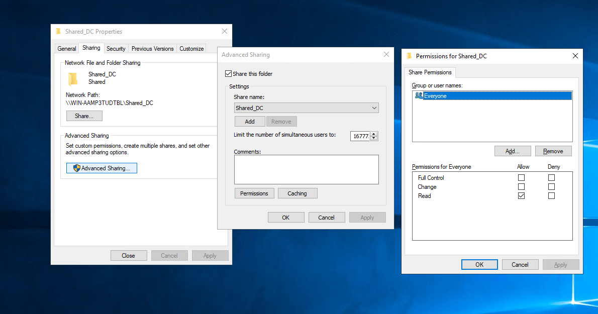

   and gave Authenticated Users Read & execute on the NTFS Security tab. GPO software installation runs as the computer account, not as a user, and computer accounts are part of Authenticated Users.

   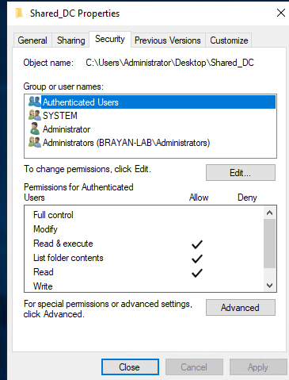

   Tried again and... nothing. Still failing.

**Getting the real error:** Event Viewer wasn't telling me enough, so I turned on verbose Windows Installer logging with a GPO:

Computer Configuration → Policies → Administrative Templates → Windows Components → Windows Installer → "Specify the types of events Windows Installer records in its transaction log" → Enabled, and don't forget to put all the flags in the Logging box: `voicewarmupx`

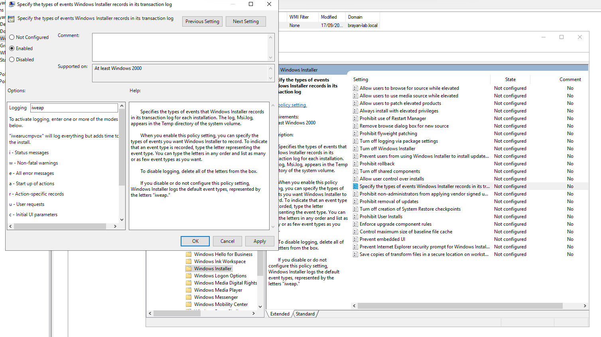

After the next reboot the installer wrote a verbose log in `C:\Windows\Temp\`: `MSI1e57.log`, 667 KB. There were also a couple of smaller ones from the earlier failed attempts, `MSI1e55.log` and `MSI1e58.log`.

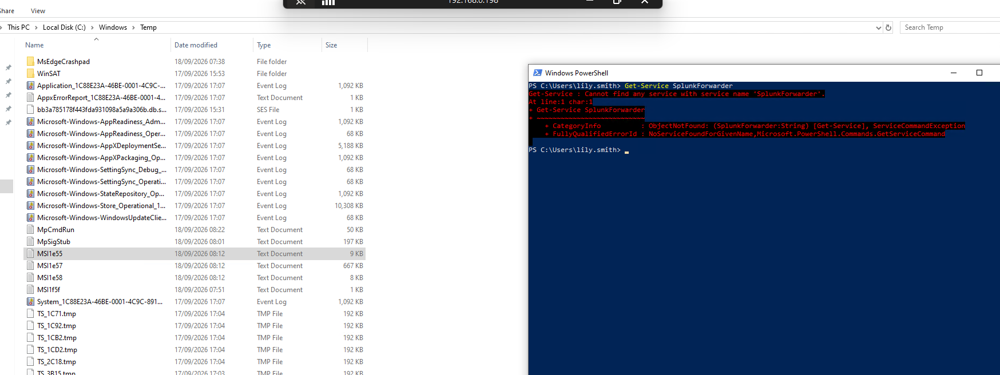

And there it was, the real failure:

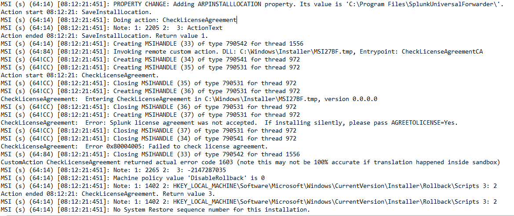

**Root cause:** it was never the network, the permissions or the timing! The Splunk UF installer refuses to install silently unless you pass `AGREETOLICENSE=Yes`. The log showed:

```
CheckLicenseAgreement: Error: Splunk license agreement was not accepted
AGREETOLICENSE = No
```

GPO Software Installation can't pass properties to an `.msi` directly, it just runs the package as it is. The supported way to change properties is an `.mst` transform (you build it with a tool like Orca and add it on the package's Modifications tab). I went with a startup script instead. It was the simpler way to start, and I had never built an `.mst` before, so this way I learned how GPO startup scripts work instead of learning a new tool at the same time.

**Fix:** first I removed the Software Installation package (option "Immediately uninstall", so the clients stop trying):

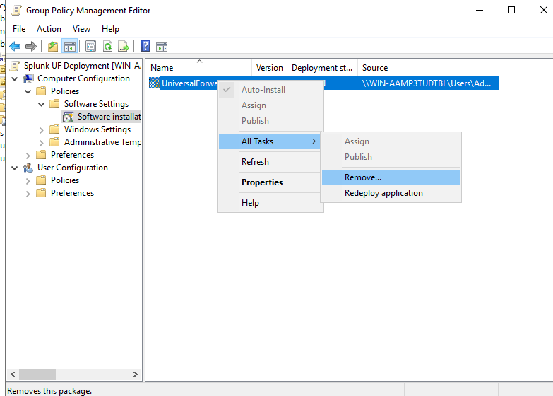

Then I made a startup script in the same GPO: Computer Configuration → Policies → Windows Settings → Scripts → Startup.

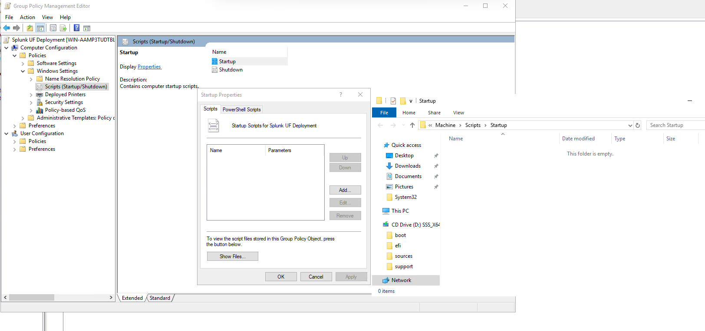

New file `installuf.bat`:

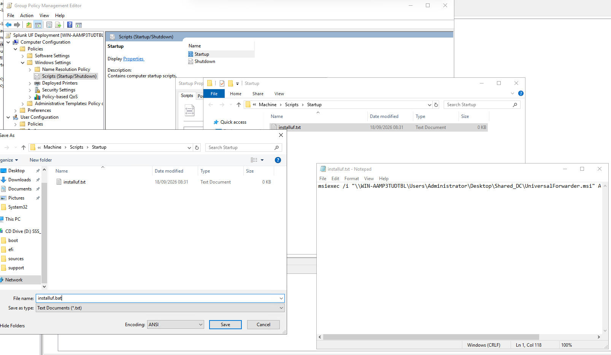

```bat
msiexec /i "\\WIN-AAMP3TUDTBL\Users\Administrator\Desktop\Shared_DC\UniversalForwarder.msi" AGREETOLICENSE=Yes /quiet
```

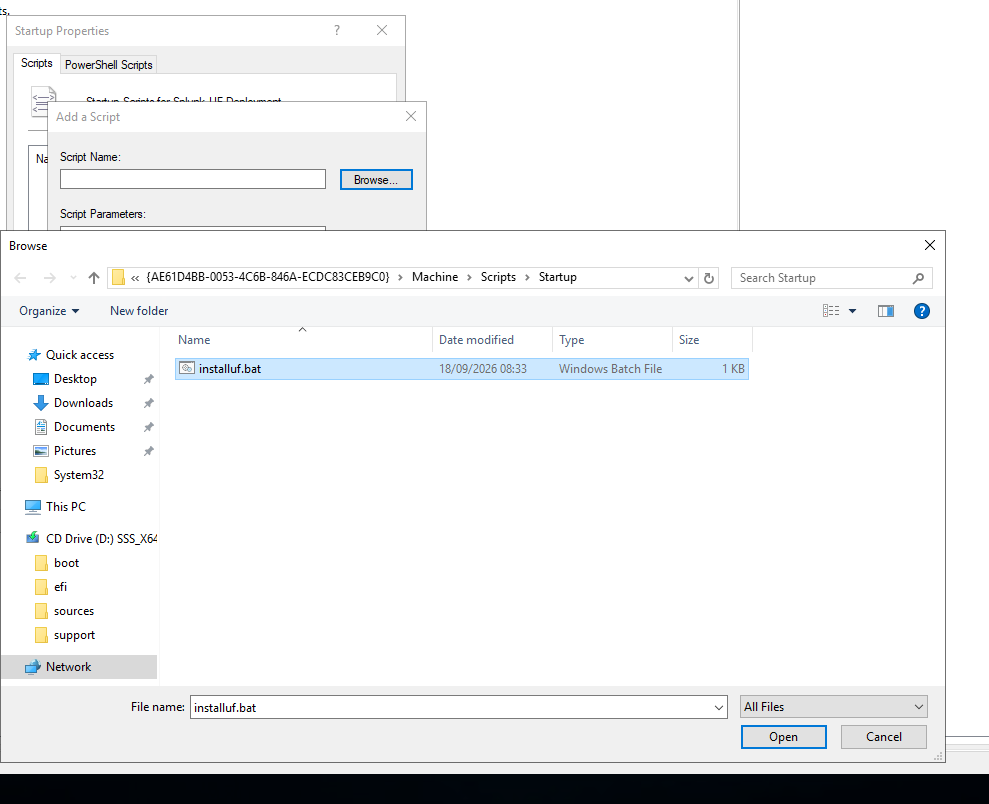
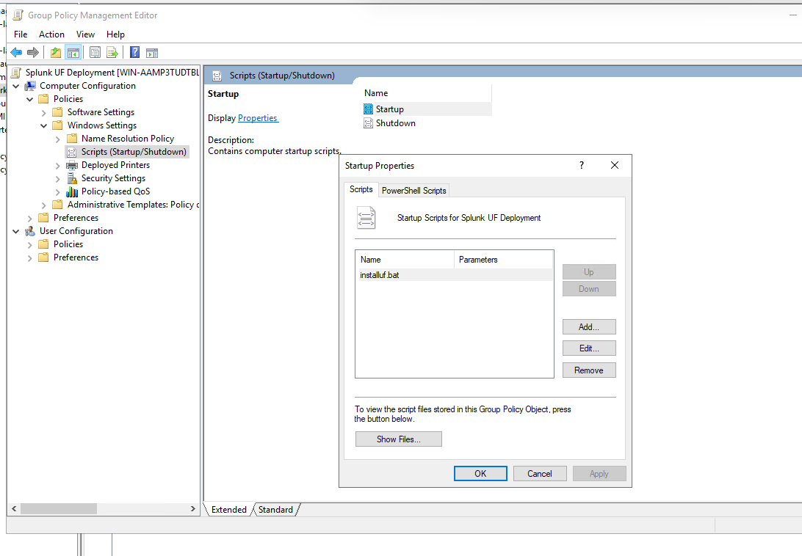

Applied the changes and restarted `win-lilly` and... it worked! The UF was installed:

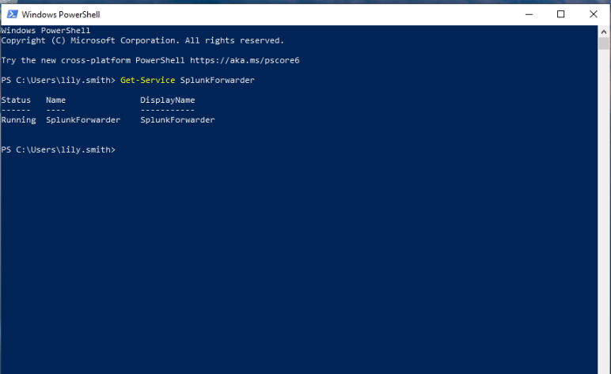

**Why `win-marcus` needed two reboots:** on `win-marcus` it only installed after the second restart. The first restart applied the updated policy and the second one actually ran the startup script.

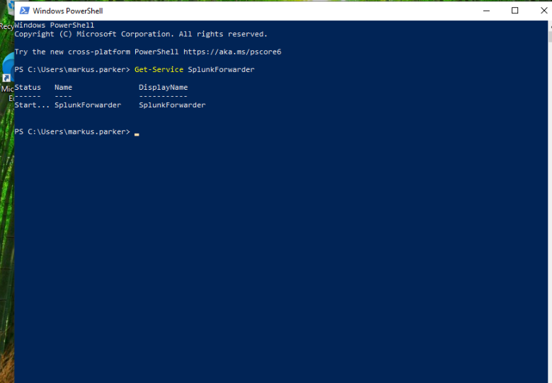

**What I'd do differently:** I changed three things (the GPO processing policy, the share permissions, the NTFS permissions) before I even had the log that showed the real cause. Next time I turn on verbose logging first, change one thing at a time, and undo the changes that weren't needed.

I didn't revert the Everyone read permission on the share, I left it so the share stays readable for future GPO pushes.

**In production:** use an `.mst` transform or a proper software deployment tool (SCCM/Intune), and host the installers on a dedicated share with read only for Domain Computers.

# Issue 2: Deployment Server not available on the Free license

**Context:** the plan was to push `inputs.conf` to the three forwarders from the Splunk Deployment Server on the indexer.

**What I built (Attempt 1, abandoned):** on the Ubuntu indexer, under `$SPLUNK_HOME/etc/deployment-apps/`, I created an app called `sysmon_inputs`:

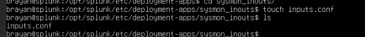

First mistake from me: I put `inputs.conf` straight in the app root. Splunk only reads `.conf` files from the app's `default/` or `local/` folders, so I created `local/` and moved it in there:

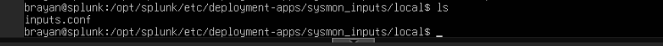

```
deployment-apps/
└── sysmon_inputs/
    └── local/
        └── inputs.conf
```

`inputs.conf` says which Sysmon event log channel to collect and which index to send it to:

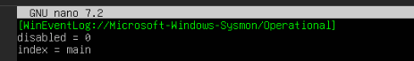

```ini
[WinEventLog://Microsoft-Windows-Sysmon/Operational]
disabled = 0
index = main
```

After that comes `serverclass.conf`, which tells the Deployment Server who gets which app. In my case `win-lilly`, `win-marcus` and the DC (`WIN-AAMP3TUDTBL`):

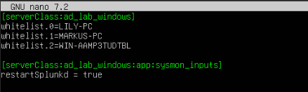

```ini
[serverClass:ad_lab_windows]
whitelist.0=LILY-PC
whitelist.1=MARKUS-PC
whitelist.2=WIN-AAMP3TUDTBL

[serverClass:ad_lab_windows:app:sysmon_inputs]
restartSplunkd = true
```

- `[serverClass:ad_lab_windows]` is a group of clients. `ad_lab_windows` is just a name I chose.
- `whitelist.N` lists the machines in the group, by hostname or even IP.
- `[serverClass:ad_lab_windows:app:sysmon_inputs]` basically says: to this group, push the app `sysmon_inputs`.
- `restartSplunkd = true` restarts the forwarder after the push. Without it the UF gets the new `inputs.conf` but doesn't use it until someone restarts the service by hand on every machine.

**Root cause (why I dropped it):** my Splunk trial had expired and the indexer went back to the Free license, and Free doesn't include the Deployment Server. So all this config only works with an Enterprise license, unfortunately.

**Fix:** push `inputs.conf` with GPO instead (Issue 3).

**In production:** Deployment Server (or a config management tool) is the right way, because the config is versioned in one place and it restarts the forwarders for you.

# Issue 3: Order of startup scripts across GPOs

**Context (Attempt 2):** I put `inputs.conf` in `Shared_DC` and wrote a startup script that copies it to each machine here:

```
C:\Program Files\SplunkUniversalForwarder\etc\system\local\inputs.conf
```

This script has its own GPO, "Splunk Configs", linked to the same workstations OU as the UF/Sysmon deployment GPO.

**Symptom:** "Splunk Configs" needs the UF to already be installed by the other GPO, so the order the scripts run in really matters.

**Root cause:** this one got me. The Link Order you see in Group Policy Management is not the order the startup scripts run in. GPOs are applied from the highest Link Order number to the lowest, so the GPO with Link Order 1 is applied, and its script runs, LAST. In my Workstations OU, "Splunk UF Deployment" was at Link Order 1 and "Splunk Configs" at Link Order 3. That means Configs was actually running *before* the UF install, the exact opposite of what I wanted!

**Fix:** for "Splunk Configs" to run after the UF is installed, it needs the *lowest* Link Order number (so it's processed, and runs, last), not the highest. The install GPO goes at a higher number so it's processed first.

**In production:** depending on GPO order is fragile. I'd put install + config + service restart in one single script that checks if the UF is installed before copying anything.

# Issue 4: Disks too small, WinRE partition blocked Extend Volume

**Symptom:** the VMs were running low on disk, and some services, including the Splunk Universal Forwarder, couldn't start because of it.

**What I tried:** I resized the virtual disks in Proxmox. Back in Windows Disk Management the new space showed up as Unallocated, but "Extend Volume" was still greyed out on C:.

**Root cause:** there was a 530 MB Recovery partition (WinRE) sitting between C: and the new Unallocated space. Windows can only extend a volume into free space that's right next to it, so the Recovery partition was in the way.

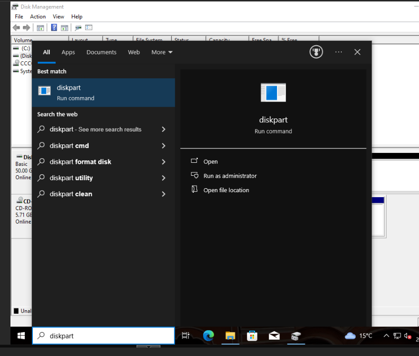

**Fix:** delete the Recovery partition with `diskpart`. A normal delete is blocked because Windows protects that partition, so you need `override`:

```
diskpart
list disk
select disk 0
list partition
select partition 3
delete partition override
```

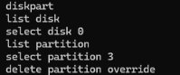

Once it was gone its space merged with the Unallocated space and finally "Extend Volume" was available:

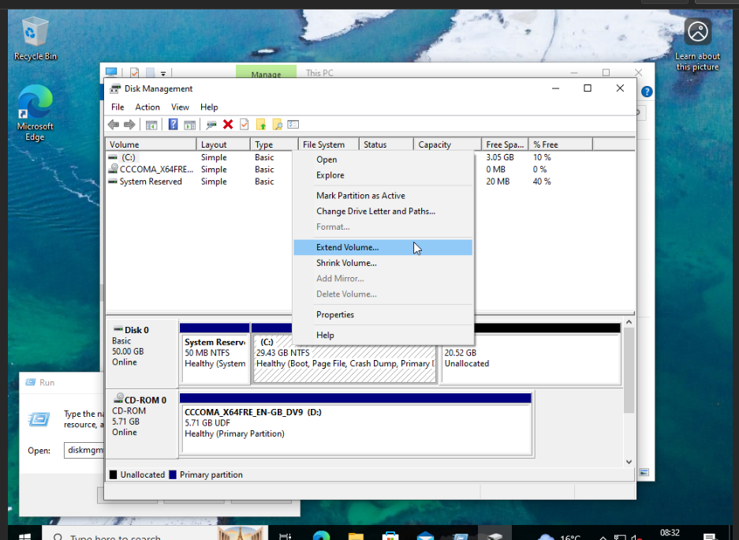

**Trade-off:** these VMs don't have the Windows Recovery Environment anymore. For lab VMs I can snapshot or rebuild, that's fine.

**In production:** size the disks properly from the start, or move WinRE to the end of the disk instead of deleting it.

# Issue 5: UF runs but can't read the Sysmon channel

**Symptom:** the DC, `win-marcus` and `win-lilly` weren't showing up in Splunk.

**Evidence:**

- The forwarder service was running.
- It connected to the indexer fine (`outputs.conf` correct, TCP 9997 reachable).
- BUT the UF log showed it couldn't subscribe to the event channel:

```
WinEventLogChannel::subscribeToEvtChannel: Could not subscribe
```

`outputs.conf` was set up the same way as `inputs.conf`: it sits in the `Shared_DC` share next to it, and the same GPO startup script copies it to each machine's local Splunk config folder.

```ini
[tcpout]
defaultGroup = default-autolb-group

[tcpout:default-autolb-group]
server = 192.168.0.199:9997
```

**Root cause:** recent UF versions don't run as Local System. They run as a virtual service account, `NT SERVICE\SplunkForwarder`, which has less privilege. The `Microsoft-Windows-Sysmon/Operational` channel has its own access list, and by default only SYSTEM, Administrators and the local Event Log Readers group can read it. The virtual account isn't in any of those. So the forwarder was running fine, but it had nothing to forward!

**Fix:** add the virtual account to Event Log Readers and restart the service:

```
net localgroup "Event Log Readers" "NT SERVICE\SplunkForwarder" /add
net stop SplunkForwarder
net start SplunkForwarder
```

I did this by hand, running the same command locally (PowerShell/CMD as Administrator) on each machine: `win-lilly`, `win-marcus` and the DC. On the DC there are no local groups, so there the command edits the domain's builtin Event Log Readers group instead.

Also, I already hit this same gotcha in an old Wazuh project (`wazuh` group / Event Log Readers). It's a pattern with least-privilege service accounts on Windows: the service runs fine, but you have to add it to the right local group before it can read a protected log source.

**In production:** apply the group membership through GPO (Restricted Groups or Group Policy Preferences → Local Users and Groups) so it's consistent and survives rebuilds.

# Result

Now everything is solved and all three hosts are sending Sysmon events to the indexer!

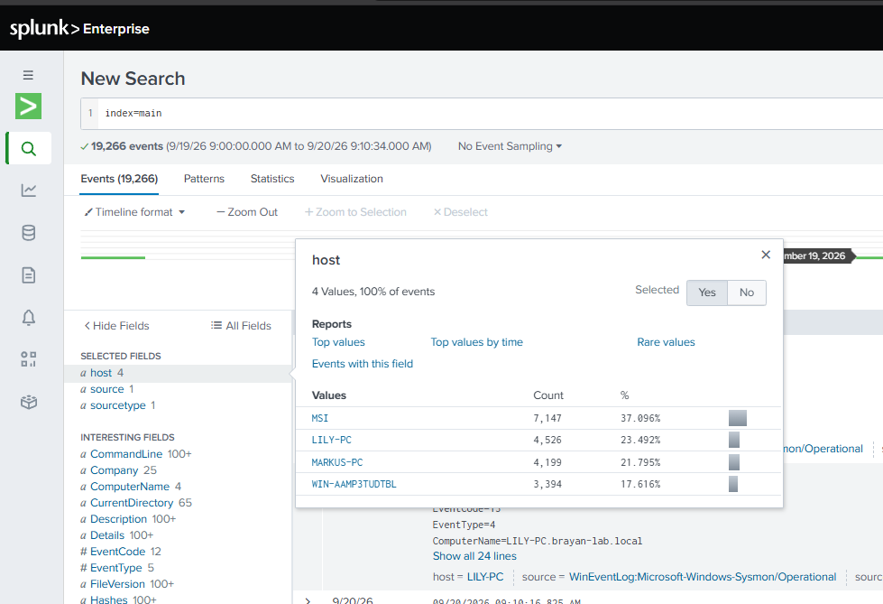

For now the events land in `index=main`. Next things I'd do are split Sysmon into its own index and make sure the Sysmon add-on is installed for field extraction.

## What I'd do differently

- Get the verbose log before changing anything, and change one thing at a time.
- Host the installers on a dedicated share, not under `C:\Users`.
- Use an `.mst` transform, or one install + config script, instead of depending on GPO order.
- Send Sysmon to its own index from the start.
- Apply the Event Log Readers membership through GPO, not by hand.
